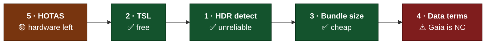

# Spikes

Five questions that needed a **measurement rather than an opinion**. Each blocked
something specific, each was small, and each is recorded here with the numbers
that came back.

> [Roadmap](roadmap.md) is what is not built yet. This was what could not be
> *planned* yet, because the answer was unknown and guessing it would have put a
> number in a design document that nobody measured.

**All five have been run.** Three came back clean, one came back with a result
that reverses a design assumption, and one is answered as far as software can
answer it and is now waiting on hardware.

---

## Status

| # | Spike | Blocks | Status | The number that mattered |
|---|---|---|---|---|
| 1 | [HDR display detection](#1--hdr-display-detection) | M2 | ✅ **Resolved — negative** | Three browsers, one display, `(dynamic-range: high)` = true, true, **false** |
| 2 | [TSL and the atmosphere integral](#2--tsl-and-the-atmosphere-integral) | M2 | ✅ **Resolved — positive** | **1.000×** against hand-written WGSL, pixel-identical |
| 3 | [Catalogue bundle size](#3--catalogue-bundle-size) | M4 | ✅ **Resolved — positive** | 150 ly, 7,529 stars + 861 planets = **159 KB brotli** |
| 4 | [Gaia and HYG attribution terms](#4--gaia-and-hyg-attribution-terms) | M4 | ⚠️ **Resolved — reverses a decision** | **Gaia is CC BY-NC 3.0 IGO**, not "open with attribution" |
| 5 | [WebHID and Gamepad for HOTAS](#5--webhid-and-gamepad-for-hotas) | M3 | 🟡 **Software answered, hardware outstanding** | WebHID: Chrome ✅, Safari ❌, Firefox ❌ · Gamepad caps at **16 axes / 32 buttons** |

Measured on 2026-08-19 on an Apple M5 MacBook (10-core GPU, Metal 3, built-in
2880×1864 Liquid Retina — **not** an XDR display), macOS 26.5, against Chrome
151.0.7922.138, Safari 26.5.2 and Firefox 153.0. Where a number depends on the
machine, that is said at the point of use.



---

## How to run one

Every spike below had the same shape, and the shape matters more than the
individual answers:

1. **Read the context.** Start with [AGENTS.md](../AGENTS.md), then the page each
   spike links. Do not start by reading the whole codebase.
2. **Build the smallest thing that answers the question.** A spike is throwaway.
   It does not need tests, it does not need to be pretty, and it does not go
   through `pnpm check`. Put it in a scratch directory and expect to delete it.
3. **Write down the number**, not the impression. "It works" is not a result.
   "7.274 ms p50 over 60 passes at 1920×1080 on an M5" is.
4. **Record the answer where the guess currently lives** — the `[OPEN QUESTION]`
   tag named in each spike. Replace the tag with the finding.
5. **If the answer changes a design decision, say so.** Spike 4 came back
   negative and it is worth more than the three that came back positive.
6. **Prove the two things you are comparing are the same thing.** Spike 2's first
   result said TSL was 2× slower. It was measuring two different workloads
   through an instrument that was lying. See
   [the trap](#the-trap-that-nearly-produced-the-wrong-answer).

**Do not** land production code from a spike. The point is to buy information, and
information bought is cheaper than code kept.

---

## 1 · HDR display detection

| | |
|---|---|
| **Blocks** | [M2](design/production.md#m2--the-believable-world) |
| **Question** | Can the page reliably tell whether it is on an extended-range display, and can the user override it in both directions? |
| **Answer** | **No, it cannot tell.** Yes, it can override. |
| **Lives in** | [`design/art.md` § HDR](design/art.md#hdr) |

### What came back

The same physical display, the same second, three browsers:

| Signal | Chrome 151 | Safari 26.5 | Firefox 153 |
|---|---|---|---|
| `(dynamic-range: high)` | **true** | **true** | **false** |
| `(dynamic-range: standard)` | true | true | true |
| `(video-dynamic-range: high)` | false | false | true |
| `(video-dynamic-range: standard)` | false | false | true |
| `(color-gamut: p3)` | true | true | false |
| `screen.isExtended` | false | *absent* | *absent* |
| `screen.colorDepth` | 30 | 24 | 30 |
| `screen.highDynamicRangeHeadroom` | *absent* | *absent* | *absent* |
| `dynamic-range-limit: standard` \| `no-limit` | ✅ | ✅ | ❌ |
| `dynamic-range-limit: constrained` | ✅ | ❌ | ❌ |
| computed initial `dynamic-range-limit` | `no-limit` | `no-limit` | — |
| WebGPU `rgba16float` canvas, `toneMapping: extended` | accepted | accepted | **throws** |
| `getConfiguration().toneMapping` echoes back | `{"mode":"extended"}` | `{"mode":"extended"}` | — |
| `vec4f(8,4,2,1)` survives the swap chain | `8, 4, 2, 1` | `8, 4, 2, 1` | — |
| WebGL2 `drawingBufferStorage` | function | *absent* | *absent* |

Firefox's failure is explicit and tracked: *"GPUCanvasContext.configure: Canvas
texture format `rgba16float` is not yet supported. Subscribe to
https://bugzilla.mozilla.org/show_bug.cgi?id=1834395"*.

### Why `(dynamic-range: high)` is not the signal it looks like

The display under test is an ordinary laptop panel — macOS reports it as
`Color LCD`, 8 bits per sample, with **no reference HDR mode**
(`maximumReferenceExtendedDynamicRangeColorComponentValue = 0.0`). What it *does*
have is EDR headroom:

```
screen: Built-in Retina Display
  maximumEDRColorComponentValue           = 2.0
  maximumPotentialEDRColorComponentValue  = 2.0
  maximumReferenceEDRColorComponentValue  = 0.0
```

**2× headroom on a panel nobody would call an HDR display.** Chrome and Safari
report `(dynamic-range: high)` for it, and they are not wrong — the compositor
really will accept values above 1.0. They are answering "will extended range be
carried?", not "is this a display worth authoring HDR for". Those are different
questions and only the first one has an API.

The rest of the signals are worse:

- `(dynamic-range: standard)` matches **everywhere**, by specification. It is not
  the negation of `high` and cannot be used as one.
- `video-dynamic-range` is unimplemented in Chrome and Safari (both sub-queries
  false) and reports **both** true in Firefox. Unusable in either direction.
- `screen.isExtended` describes multi-monitor topology, not dynamic range. It was
  `false` on a single-display machine that reports `dynamic-range: high`.
- There is **no headroom API**. The page cannot distinguish 2× from an XDR
  display's ~16×, so it cannot tune a tone curve to the display it is on.

### The recommendation

```js
// Capability, not display quality. The media query says the compositor will
// carry extended range; the WebGPU configure says this browser can produce it.
// Neither says the panel is worth it, and nothing available says how much
// headroom there is — so the curve must not assume a number.
const canOutputExtendedRange =
  'gpu' in navigator &&
  window.matchMedia('(dynamic-range: high)').matches &&
  await probeExtendedCanvas()          // configure rgba16float + toneMapping:'extended'
```

- `probeExtendedCanvas()` is the load-bearing half. It is what excludes Firefox,
  and it is a feature test rather than a guess about hardware.
- `dynamic-range-limit`'s initial value is already `no-limit`, so nothing is
  needed to opt *in*; `standard` is the opt-*out* lever and it inherits, which
  makes "clamp everything under this subtree" a one-line CSS change.
- The media query is live — attach a `change` listener rather than reading once,
  because a window can move between displays.
- **The three-state setting was already mandatory and remains so.** Auto is now
  defined as the expression above.

### Correction to what the bible said

`ExtendedSRGBColorSpace` is **not** a `three` core export. It lives in
`three/examples/jsm/math/ColorSpaces.js`, and in r182 its
`outputColorSpaceConfig.toneMappingMode` is dead weight —
`ColorManagement.getToneMappingMode()` has **no caller** anywhere in `src/`. The
WebGPU backend derives everything from one constructor parameter:

```js
// WebGPUUtils.getPreferredCanvasFormat() → GPUTextureFormat.RGBA16Float
// WebGPUBackend, line 260 → toneMapping: { mode: 'extended' }
new THREE.WebGPURenderer({ outputType: THREE.HalfFloatType })
```

Setting `renderer.outputColorSpace` alone does **not** turn on extended output.
`outputType: HalfFloatType` does, and it sets both the canvas format and the tone
mapping mode together.

### Still unmeasured

Needs hardware this project does not have: an XDR or true-HDR display, Windows
with HDR on and off, a Linux/Chrome baseline, whether the media query updates when
a window is dragged between displays, and whether live EDR headroom changes with
screen brightness produce a `change` event. **None of these change the
recommendation** — they would only change how often `auto` is right, and the
manual override exists because it will sometimes be wrong.

---

## 2 · TSL and the atmosphere integral

| | |
|---|---|
| **Blocks** | [M2](design/production.md#m2--the-believable-world) |
| **Question** | Does Three.js's shading language cost anything material on a dense atmosphere integral, or is a hand-written WebGPU pass needed? |
| **Answer** | **It costs nothing measurable.** Take TSL and stop thinking about it. |
| **Lives in** | [`design/technical.md` § The WebGPU migration](design/technical.md#the-webgpu-migration) |

### Method

The same single-scattering Rayleigh + Mie + ozone raymarch written twice — once in
TSL, once by hand in WGSL — then **both run as raw WebGPU pipelines in one
harness**: same `rgba16float` 1920×1080 target, same fullscreen triangle, same
uniforms, GPU time from `timestamp-query`, A and B interleaved so clock ramping
hits both equally, 60 passes each after 20 warm-up passes.

The TSL side is not the TSL *renderer* — it is the WGSL that three's node system
generates, harvested with `renderer.debug.getShaderAsync()` and then run through
the identical harness. That isolates the code generator, which is what the
question is about.

**Outputs verified pixel-identical before any timing was believed.**

### What came back

32 view × 8 light samples, 1920×1080, Apple M5:

| Case | Hand-written WGSL | TSL-generated WGSL | Ratio |
|---|---|---|---|
| Orbit, 400 km | p50 **0.393 ms** · p95 0.459 | p50 **0.393 ms** · p95 0.459 | **1.000×** |
| High, 60 km | p50 **7.274 ms** · p95 7.340 | p50 **7.274 ms** · p95 7.340 | **1.000×** |
| Ground, 2 m | p50 **7.274 ms** · p95 7.340 | p50 **7.274 ms** · p95 7.274 | **1.000×** |

| | Hand-written | TSL-generated |
|---|---|---|
| Source size | 3,859 B · 121 lines | 5,196 B · 188 lines (**+35%**) |
| Pipeline build, median of 6, cache defeated | **1.00 ms** | **0.90 ms** |

The 15% threshold the spike set for "take TSL and stop thinking about it" was met
by a factor of ten. Chrome's timestamp results are quantised to ~65.5 µs on this
machine, so the orbit case is at the resolution floor — the two are
indistinguishable there rather than merely close.

### What the generated code looks like

Readable, and structurally different from hand-written WGSL in exactly one way
that matters:

- **Everything is inlined.** No function calls survive; each TSL `Fn` is expanded
  at each call site, including inside both loop nests.
- **Every intermediate becomes a function-scope `var`** — 37 of them, hoisted to
  the top — where a person writes `let`. This is the one thing that could have
  cost register pressure, and on Metal it does not: Tint and the Metal compiler
  promote them.
- Constants are not folded (`(0.8 * 0.8)` survives into the output); the backend
  compiler folds them.
- The file opens with `diagnostic(off, derivative_uniformity)`, and WGSL requires
  directives before all global declarations — so generated code cannot simply be
  concatenated after anything else.

### The trap that nearly produced the wrong answer

The first attempt measured the TSL path through `three`'s renderer using
`renderer.info.render.timestamp` and got **14.615 ms against the hand-written
7.274 ms** — a clean, plausible, completely false 2×.

`renderer.info.render.timestamp` over-reports when there is a canvas output pass.
Rendering the identical material to an offscreen target reported 7.274 ms; the
same frame to the canvas reported 14.615 ms. Independent wall-clock, measured by
submitting 40 frames and awaiting `queue.onSubmittedWorkDone()`:

| Same workload, same material | To canvas | To offscreen target |
|---|---|---|
| Wall clock, queue-drained | **7.375 ms/frame** | **7.265 ms/frame** |
| `renderer.info.render.timestamp` | 14.615 ms | 7.274 ms |

The canvas output pass really costs **0.11 ms (1.5%)**. The instrument was
double-counting. Two lessons, both cheap to carry forward:

1. **`renderer.info.render.timestamp` is not trustworthy on the canvas path.** Use
   wall clock across a drained queue, or a raw timestamp query.
2. A 2× result that is *exactly* 2× deserves suspicion before it deserves a
   design change.

### The consequence nobody asked for

7.274 ms for 256 samples per pixel at 1080p **on an M5** is already **2.4× over
the 3.0 ms atmosphere-and-post budget**, on a GPU far faster than the
[target machine](design/technical.md#performance-budgets). Scaling to fit gives
about 105 samples per pixel — roughly 16 view × 6 light — which is not enough for
a clean horizon.

**So Bruneton's precomputed transmittance and multiple-scattering LUTs are not an
optimisation, they are a requirement.** The spike was written to ask whether TSL
could express the integral cheaply enough. It can; the integral itself cannot be
evaluated per-pixel per-frame at any language's speed.

### Still unmeasured

Full Bruneton multiple scattering with LUT precomputation, the precompute cost and
whether it amortises across frames, register pressure (no tooling exposes it), and
behaviour on the 2023-class integrated GPU that is the actual target. **The ratio
is what transfers between machines; the absolute milliseconds do not.**

---

## 3 · Catalogue bundle size

| | |
|---|---|
| **Blocks** | [M4](design/production.md#m4--the-explorer--mvp) |
| **Question** | What does a packed catalogue sphere actually cost over the wire, at 25 ly and at 150 ly? |
| **Answer** | **159 KB brotli for everything out to 150 ly.** Bundle it all. |
| **Lives in** | [`design/galaxy.md` § Ingest pipeline](design/galaxy.md#ingest-pipeline) |

### Source

**HYG v4.4**, `hyg/CURRENT/hyg_v44.csv.gz` — 119,614 rows, of which 109,390 have
a usable parallax (10,224 carry HYG's `dist >= 100000` "no usable parallax"
sentinel and must be dropped, not clamped).

> **The dataset moved.** HYG is now at
> [codeberg.org/astronexus/hyg](https://codeberg.org/astronexus/hyg); the GitHub
> repository is frozen and its newest file is v4.1. The files are git-lfs
> pointers, so a plain `raw/` fetch returns a 133-byte pointer file — use
> Codeberg's `media/` path. Both facts cost time to discover; the ingest pipeline
> should pin the source URL and assert on the decompressed row count.

### The packed record

16 bytes per star, which is the whole answer to "what does it cost":

| Bytes | Field | Note |
|---|---|---|
| 0–8 | position, 3 × int24 | galactic cartesian, quantised against the chunk extent |
| 9 | spectral class | class × subclass × giant flag, one byte |
| 10–11 | absolute magnitude, int16 ×100 | luminosity is `10^((4.85 − M)/2.5)` — **do not store it as well** |
| 12–13 | colour index B−V, int16 ×1000 | `-32768` is "unknown"; drives the render colour |
| 14 | flags | component count, has-name, provenance |
| 15 | reserved | |

Plus an 8-byte identity row per star (HYG id + HIP) and a designation table for
the stars that have one. Position resolution at 150 ly is **1.13 AU per step**,
worst observed quantisation error **0.94 AU** — four orders of magnitude below the
parallax uncertainty at that distance, so the quantiser is free.

### What came back

| Radius | Stars | HYG rows as JSON | …brotli | Packed | …brotli | + ids + names, brotli |
|---|---|---|---|---|---|---|
| **25 ly** | 166 | 92.4 KB | 18.7 KB | 2.6 KB | 2.4 KB | **4.1 KB** |
| **50 ly** | 978 | 541.8 KB | 103.6 KB | 15.3 KB | 12.9 KB | **21.1 KB** |
| **100 ly** | 4,049 | 2.18 MB | 417.2 KB | 63.3 KB | 52.3 KB | **81.9 KB** |
| **150 ly** | 7,529 | 4.04 MB | 769.0 KB | 117.6 KB | 97.0 KB | **143.6 KB** |

Columnar beats interleaved by **7–8%** after brotli — the same fields laid out
structure-of-arrays compress better because like values sit together. Free, so
take it.

**Confirmed planets, live from the NASA Exoplanet Archive TAP service on
2026-08-19:**

| Radius | Host systems | Planets |
|---|---|---|
| 25 ly | 39 | 84 |
| 50 ly | 120 | 216 |
| 100 ly | 314 | 520 |
| 150 ly | **550** | **861** |

At 20 bytes per planet plus names, the whole planet layer to 150 ly is **15.2 KB
brotli**.

### Against the app it ships beside

Measured from `pnpm build` on the same day:

| | Raw | gzip | brotli |
|---|---|---|---|
| `index.js` | 1,155,149 B | 324.6 KB | 249.3 KB |
| `index.css` | 15,554 B | 3.9 KB | 3.4 KB |
| `universe.worker.js` | 20,127 B | 8.1 KB | 7.3 KB |
| **Total client** | 1.19 MB | ~337 KB | **~260 KB** |
| **150 ly catalogue** | 274 KB | — | **~159 KB** |

The full local tier is **61% of the current client** and lands the whole download
around 420 KB. That is not a conversation, it is a rounding error against the
4-second cold-load budget. **Bundle everything to 150 ly.**

### Chunking, for when it does become streamed

Cell-local coordinates (rebasing to the cell origin before quantisation — the
first attempt did not, clamped every value, and produced a *negative* chunking
penalty, which is what a bug looks like):

| Cell | Non-empty cells | Summed brotli | Largest cell | Median cell | vs one blob |
|---|---|---|---|---|---|
| 10 ly | 5,132 | 137.7 KB | 0.17 KB | 0.02 KB | +47% |
| 25 ly | 1,030 | 118.5 KB | 0.61 KB | 0.08 KB | +26% |
| **50 ly** | **173** | **105.1 KB** | 3.33 KB | 0.46 KB | **+12%** |
| 75 ly | 62 | 99.9 KB | 6.82 KB | 1.39 KB | +7% |

Compression wants big chunks and request count wants few of them, and they agree:
**50 ly cells**. 25 ly cells cost 26% more bytes across 1,030 requests to save
nothing.

### The finding that actually matters

**Size was never the constraint. Completeness is.**

| Volume | HYG entries | Best available census | HYG coverage |
|---|---|---|---|
| 10 pc (32.6 ly) | 324 | 462 objects in 317 systems — RECONS, 2018.3 | ~70% |
| 25 pc (81.5 ly) | 3,072 | 5,931 objects — CNS5, Golovin et al. 2023 | **~52%** |

CNS5's 5,931 is 5,230 stars plus 701 brown dwarfs, so HYG holds roughly **59% of
the known stars within 25 pc and none of the brown dwarfs**. And its character
changes with distance — the fraction of entries carrying a Gliese (nearby-star)
identifier falls from **95% at 50 ly to 80% at 100 ly to 47% at 150 ly**, with the
apparent-magnitude histogram peaking at V≈8. Inside ~50 ly HYG is a
volume-complete catalogue; by 150 ly it is a magnitude-limited one wearing the
same shape.

That does not break the design — it sharpens it. [The horizon of
knowledge](design/galaxy.md#the-horizon-of-knowledge) is already a first-class
idea, and this says the boundary is much closer than 150 ly for M dwarfs and much
further for bright stars. **The shell is not a sphere, and drawing it as one would
be a lie the design has already promised not to tell.**

### One ingest gotcha, found by parsing the file

HYG spectral types are not uniform MK strings. Within 150 ly: **610 entries have
none**, **163 are white dwarfs** (`DA2`, `DZ`…), and around 200 use Yale-style
prefixes (`dM4`, `sdK7`, `gK5`) that a `spect[0]` test mislabels. A naive
first-character parse classifies 6,551 of 7,529 — **87%**, quietly wrong about the
other 13%. Strip the prefix, handle `D…` as its own class.

---

## 4 · Gaia and HYG attribution terms

| | |
|---|---|
| **Blocks** | [M4](design/production.md#m4--the-explorer--mvp) |
| **Question** | What exactly do the licences require, and where must the attribution appear? |
| **Answer** | **Gaia is CC BY-NC 3.0 IGO.** That is not what the bible assumed and it changes the ingest plan. |
| **Lives in** | [`design/sustainability.md` § Data licensing](design/sustainability.md#data-licensing-is-the-constraint-that-bites) |

### The finding

The bible recorded Gaia as *"Open with attribution"*. ESA's own licence page says
otherwise, verbatim:

> Gaia data are distributed under the CC BY-NC 3.0 IGO license.
> — [cosmos.esa.int/web/gaia-users/license](https://www.cosmos.esa.int/web/gaia-users/license)

and the archive terms it points at:

> Data hosted in the ESA Space Science Archives are distributed under the
> CC BY-NC 3.0 IGO licence.
>
> Prior to any commercial use by the User of any Data or Data Product, including
> any use or application that directly or indirectly generates a financial gain, a
> detailed request for authorisation/licence shall be made by the User by sending
> email to data.licences@esa.int.
> — [ESA Space Science Archives terms and conditions](https://www.cosmos.esa.int/web/esdc/terms-and-conditions)

**Non-commercial.** [Sustainability](design/sustainability.md#the-non-commercial-trap-stated-plainly)
argues at length that a non-commercial clause is not an open source licence and
that the project deliberately avoided one. Bundling Gaia would attach exactly that
restriction to the shipped artefact — not to the Apache-2.0 code, but to the data
the game cannot run without.

There is a conflicting statement in Gaia's own DR3 documentation — *"The Gaia data
are open and free to use, provided credit is given to 'ESA/Gaia/DPAC'"* — which
reads much more permissively than the licence page. **A documentation page and a
licence page that disagree are a reason to take the stricter one**, and to ask ESA
in writing before relying on the looser one.

### The strings, verbatim

| Where | What must appear |
|---|---|
| **Gaia — credit line** | `Credit: ESA, Gaia DPAC` |
| **Gaia — full acknowledgement** | "This work has made use of data from the European Space Agency (ESA) mission Gaia (https://www.cosmos.esa.int/gaia), processed by the Gaia Data Processing and Analysis Consortium (DPAC, https://www.cosmos.esa.int/web/gaia/dpac/consortium). Funding for the DPAC has been provided by national institutions, in particular the institutions participating in the Gaia Multilateral Agreement." |
| **HYG** | CC BY-SA 4.0 (v4.x; v3.x was CC BY-SA 2.5). Credit *The HYG Database, astronexus*, link the licence, link the source, and state that it was modified. |
| **NASA Exoplanet Archive** | "This research has made use of the NASA Exoplanet Archive, which is operated by the California Institute of Technology, under contract with the National Aeronautics and Space Administration under the Exoplanet Exploration Program." Cite Christiansen et al. (2025). |

### Does share-alike reach the packed binary? Yes. Does it reach the code? No.

CC BY-SA 4.0 § 4(b), verbatim:

> if You include all or a substantial portion of the database contents in a
> database in which You have Sui Generis Database Rights, then the database in
> which You have Sui Generis Database Rights **(but not its individual contents)**
> is Adapted Material, including for purposes of Section 3(b)

So the packed catalogue from [spike 3](#3--catalogue-bundle-size) **is Adapted
Material and must carry CC BY-SA 4.0**. The emphasis is the load-bearing part: the
obligation attaches to the database, not to everything that touches it. Apache-2.0
on `packages/*` and CC BY-SA 4.0 on the catalogue coexist without conflict,
because they cover different works.

**That has a concrete engineering consequence.** The packed catalogue must ship as
its own asset with its own licence notice beside it — *not* inlined into the JS
bundle as a literal, which would blur exactly the boundary the licences depend on.
A separate `.bin` fetched at runtime is an aggregation; a base64 blob compiled into
`index.js` invites the argument that it is not.

§ 3(a)(1) sets what the notice has to contain: creator identification, a copyright
notice, a notice referring to the licence, a notice referring to the warranty
disclaimer, a URI to the source, an indication that it was modified — satisfiable
"in any reasonable manner based on the medium".

### NASA is not confirmed public domain

The bible recorded the archive as "US Government work, public domain". **The
archive's own pages state no licence at all.** It is operated by Caltech under
NASA contract, and its values are drawn from the published literature. The
defensible position: the individual measurements are facts and facts are not
copyrightable in the US, while the compilation may attract database right in the
EU. Treat the requested acknowledgement as the obligation, use it, and stop
describing the data as public domain in project documentation.

### Recommendation

1. **Ship HYG + NASA. Keep Gaia out of the bundle** until ESA answers a written
   request at `data.licences@esa.int`. HYG's CC BY-SA is share-alike, which is an
   obligation; Gaia's CC BY-NC is a restriction, which is a different kind of
   problem.
2. **Beware AT-HYG.** The Gaia-derived HYG-like set is published as CC BY-SA 4.0
   but is built on Gaia DR3 data. Do not adopt it without resolving that.
3. **`NOTICE` becomes required at the first ingest**, and the licence text plus
   all three attribution strings go in it in the same change that first reads a
   dataset.
4. **In-product attribution on the catalogue panel**, as the design already
   wanted. Obligation and design goal agree, which is rare enough to bank.

### The stated fallback was backwards

The spike's fallback read: *"if HYG's share-alike proves awkward, rebuild the
ingest from Gaia and the NASA archive directly."* **That is strictly worse.** It
trades a share-alike obligation for a non-commercial restriction and throws away
HYG's pre-merged cross-catalogue identity resolution. HYG is the licence-clean
source; Gaia is the encumbered one.

---

## 5 · WebHID and Gamepad for HOTAS

| | |
|---|---|
| **Blocks** | [M3](design/production.md#m3--the-pilot), and a public promise |
| **Question** | Is many-axis HOTAS support achievable in a browser at all? |
| **Answer** | **Yes — on Chromium, via WebHID.** Nowhere else, and the Gamepad API alone is not enough. |
| **Lives in** | [`design/ux.md` § Controls](design/ux.md#controls) |

### Measured — API surface, three browsers, same machine

| | Chrome 151 | Safari 26.5 | Firefox 153 |
|---|---|---|---|
| `navigator.hid` | **present** | **absent** | **absent** |
| `navigator.usb` | present | absent | absent |
| `navigator.getGamepads` | present | present | present |
| `Gamepad.vibrationActuator` | ✅ | ✅ | legacy `hapticActuators` |

Mozilla's position on WebHID is **negative**, and it is a settled one rather than
a backlog item. Verbatim:

> This API, like WebUSB, provides access to generic devices. Though this API is
> limited to human interface devices (HID), the same concerns apply as WebUSB,
> namely that devices are generally not designed with access from arbitrary
> websites in their threat model.

WebKit's standards-positions issue is open with no position stated, and Safari has
not shipped it. **Plan for WebHID being Chromium-only indefinitely.**

### Measured — what the Gamepad API costs you, from Chromium's source

| Fact | Source |
|---|---|
| `kAxesLengthCap = 16` | `device/gamepad/public/cpp/gamepad.h` |
| `kButtonsLengthCap = 32` | same |
| Polling at **250 Hz** on a dedicated thread | `kPollingIntervalMilliseconds = 4` in `device/gamepad/gamepad_provider.cc` |
| Axes normalised from the element's own logical min/max at 8/16/32-bit report size | `gamepad_device_mac.mm` |

The button cap is worse than a cap. On macOS, buttons are indexed by **HID usage
number**, and the code reads:

```cpp
// Ignore buttons with large usage values.
if (button_index >= Gamepad::kButtonsLengthCap)
  continue;
```

A button whose usage number exceeds 32 is **silently dropped** — not packed into a
free slot, not reported, gone. Axes get better treatment: high-usage axes are
remapped into free indices in a second pass, up to 16. A HOTAS throttle with
buttons declared above usage 32 will therefore appear to work and quietly lose
inputs, which is the worst failure mode available.

Axis resolution is *not* a problem: normalisation uses the device's own logical
range at its native report size, so a 16-bit axis keeps all 65,536 steps. The
250 Hz poll downsamples a 1000 Hz device but is well inside what flight needs.

### Measured — WebHID will actually talk to a stick

Chromium's protected-usage list (`services/device/public/cpp/hid/hid_report_utils.cc`,
`IsAlwaysProtected`) blocks the keyboard usage page and, on Generic Desktop:
Pointer, Mouse, Keyboard, Keypad, and the System Control ranges. Plus the FIDO
usage page and a vendor/product blocklist (Yubikey, Feitian, Titan…).

**Joystick (0x04) and Gamepad (0x05) are not protected.** A HOTAS top-level
collection is reachable.

WebHID is event-driven (`inputreport` events, no polling interval), permission
persists per origin and is enumerated by `getDevices()`, `requestDevice()` needs a
user gesture and shows a device chooser, and `device.forget()` revokes.

### What this means for the design

| Scheme | Where it works | Ceiling |
|---|---|---|
| Mouse + keyboard | Everywhere | None |
| Gamepad | Everywhere | 16 axes, 32 buttons, silent loss above usage 32 |
| **HOTAS / HOSAS, full fidelity** | **Chromium only** | The device's own limits |

HOTAS can be promised **with the browser named**. "Full 6-DoF axis binding with no
emulation layer, in Chrome and Edge" is honest; "HOTAS support" unqualified is
not, and would have to be withdrawn for half the audience.

### Still unmeasured — and this is the part that still holds the promise

No HOTAS hardware was available. Everything above is API surface and browser
source; none of it is a device test. Outstanding:

- Does a real stick-and-throttle pair enumerate as **two independent devices**,
  and stay stable across a reconnect?
- Do real devices put buttons above usage 32 in practice? (Virpil and VKB
  throttles are the suspects.)
- End-to-end latency versus the same device natively.
- Is there visible quantisation in a slow roll?
- What does the chooser actually cost a player who has never seen one?

**Run this on hardware before the promise goes in a README.** The software half
says it is possible; the hardware half says whether it is pleasant.

---

## Related

- [Roadmap](roadmap.md) — what is not built yet, and the seam for each
- [Design bible](design/README.md) — where each of these numbers now lives
- [`design/appendix.md`](design/appendix.md#the-five-engineering-spikes--run-2026-08-19) — the same five, from the design side
- [AGENTS.md](../AGENTS.md) — the rules that apply to anything that outlives a spike
