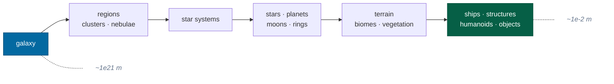

# Vision and scope

What InertialRef is trying to become, what it is today, and the principles that
decide what gets built and how.

> This is the charter. [Roadmap](roadmap.md) is the ordered work;
> [architecture](architecture.md) is the shape of what exists.

---

## The product

A seamless, browser-based, 6-DoF simulation of the Milky Way, spanning an
enormous range of scale:

A player should be able to fly continuously from interstellar space to a
planetary surface and pick up something measured in inches — **without ever
crossing a mode boundary**.

That last clause is the whole design constraint. There is no "space mode" and no
"planet mode". Internally there are hierarchical representations and transitions,
and they are expected and encouraged, but they must compose into one coherent
continuous universe rather than appearing to gameplay as separate worlds.

### The gameplay it is being built for

1. Piloting spacecraft with full 6-DoF movement — **works**
2. Travelling within star systems — **works**
3. Travelling between star systems — *possible but slow; wants a warp mechanic*
4. Approaching and orbiting planets — **works**
5. Atmospheric entry — *drag and atmosphere modelled; no heating or stress*
6. Landing — **works**
7. Surface exploration — *you can land and fly; there is nothing to find yet*

Everything beyond that — economy, combat, construction, life — is out of scope
for now, but nothing in the architecture should make it harder later. That is
the real test applied to every decision here.

---

## What is proven today

Milestone 1 was a **vertical architectural proof**: not a game, but evidence
that the assumptions everything else depends on actually hold. Twelve claims,
executable rather than asserted, runnable in Node (`pnpm sim --self-test`) and in
the browser (`await ir.selfTest()`):

| # | Claim | Measured |
|---|---|---|
| 1 | Deterministically generate the same systems from a global seed | identical across runs; differs by seed |
| 2 | Address every generated object with a stable id | all bodies round-trip through text |
| 3 | Place systems at astronomical distances | Sol → Alpha Centauri: 4.3650 ly |
| 4 | Move within a system | 6.81 km under thrust in 10 s |
| 5 | Approach a planet | fell 18.74 m in 60 s — within 0.03% of free fall |
| 6 | Transition into increasingly local frames | entered a planet frame mid-flight |
| 7 | Preserve precision near the surface | 1 inch resolved to 9.4 µm, 8.18 kpc out |
| 8 | Render metre-scale objects near the player | 1 m survives float32 at 8.18 kpc |
| 9 | Rebase render origins without moving entities | 500 rebases, 2,560 km, zero drift |
| 10 | Run a meaningful procedural task in a worker | 4,225 terrain samples, identical to local |
| 11 | Serialize and restore world/player state | ~600 bytes → identical state hash |
| 12 | Run the simulation independently of frame rate | same hash at 60 Hz, 144 Hz and 100× warp |

The point of listing measurements rather than ticks: a self-test that cannot
fail informatively converts an unknown into a false assurance.

---

## Principles

These are charter-level. Day-to-day rules live in
[AGENTS.md](../AGENTS.md); these are the reasons those rules exist.

### Build a platform, not a demo

The objective is **InertialRef as a simulation platform first and a collection
of visual demos second**. Every early decision should make the eventual galaxy
easier to build rather than quietly placing a ceiling on it.

Concretely: when a shortcut would make the current milestone easier and the
eventual scale harder, take the harder path now. Sectorised coordinates cost
more than a `Vector3` and were never optional, because retrofitting precision
into a codebase that assumed doubles is a rewrite.

### Never sacrifice spatial correctness for demo convenience

The precision model is the one thing that cannot be added later. Anything that
would compromise it — an absolute position in a `Vec3`, a render coordinate
treated as truth, a frame-local vector cached as canonical — is rejected even
when it would work fine at today's scale.

### Correct abstractions over feature breadth

Favour determinism, testability, automation, observability and incremental
evolution over breadth. A shallow system with the right seams beats a deep one
with the wrong ones, because the first grows and the second gets replaced.

### No opaque abstractions

Do not introduce an abstraction without demonstrating its purpose. Every port,
every indirection, every layer in this codebase has at least one *second*
implementation or one test that could not exist without it:

| Abstraction | What justifies it |
|---|---|
| `WorkerPort` | an in-process implementation that makes the pool testable in Node |
| `SaveStore` | an in-memory store used by every persistence test |
| `rendering` emitting data, not Three.js | render logic tested without a GPU |
| Frame anchors as closures | `spatial` never learns what an orbit is |

If a new abstraction cannot name its justification, it is speculative structure
and should wait until it can.

### Assume it will be built by agents

The repository is optimised so that someone — human or coding agent — who has
never seen it can understand, modify, test and verify the system without tribal
knowledge. That means: deterministic non-interactive commands with useful exit
codes, documentation that explains *why*, decision records for what is expensive
to reverse, and a build log of what has already been learned.

### Document assumptions, not just code

Do not silently make a foundational decision that a future engineer will have to
reverse-engineer. If a choice has consequences beyond the file it lives in, it
gets an [ADR](adr/README.md). If it is a fact learned the hard way, it goes in
[CONTEXT.md](../CONTEXT.md).

### Measure before optimising

Performance matters, and blind pre-optimisation does not. Design so that object
pooling, typed arrays, instancing, spatial indexes, worker pools, transferable
buffers, WASM, WebGPU and shared memory all remain *possible* — then apply them
when a measurement says to.

---

## How work proceeds

For each substantial change: **understand → design → implement → test → verify →
document.** After a meaningful milestone: run the tests, the type checks, the
lint, the build, and update the documentation that the change invalidated.

A task is not done because the browser renders something. It is done when the
implementation is correct, the architectural boundaries hold, determinism
remains determinism, tests exist and pass, `pnpm check` is green, the
documentation reflects any meaningful architectural change, and the debug
tooling can inspect the new behaviour.

When a defect exposes a missing invariant, add the regression test rather than
patching the symptom. [CONTEXT.md](../CONTEXT.md) lists the ones found so far —
each of which was invisible in a running browser.

---

## Non-goals, for now

| Not doing | Why |
|---|---|
| Polished art | Debug primitives are *preferable* while proving architecture |
| Multiplayer | Deferred to a later phase; seams and [ADR-0008](adr/0008-multiplayer-partitions.md) only |
| n-body gravity | Patched conics are sufficient and analytic; n-body is a correction to add on top |
| A content pipeline | Everything is generated; there are no assets to pipeline yet |
| Mobile / touch | Not a constraint on any current decision |

---

## Related

- [Architecture](architecture.md) — how the current system is built
- [Roadmap](roadmap.md) — what is next, and what is deliberately absent
- [ADRs](adr/README.md) — the decisions that shaped it
- [AGENTS.md](../AGENTS.md) — the rules for changing it
